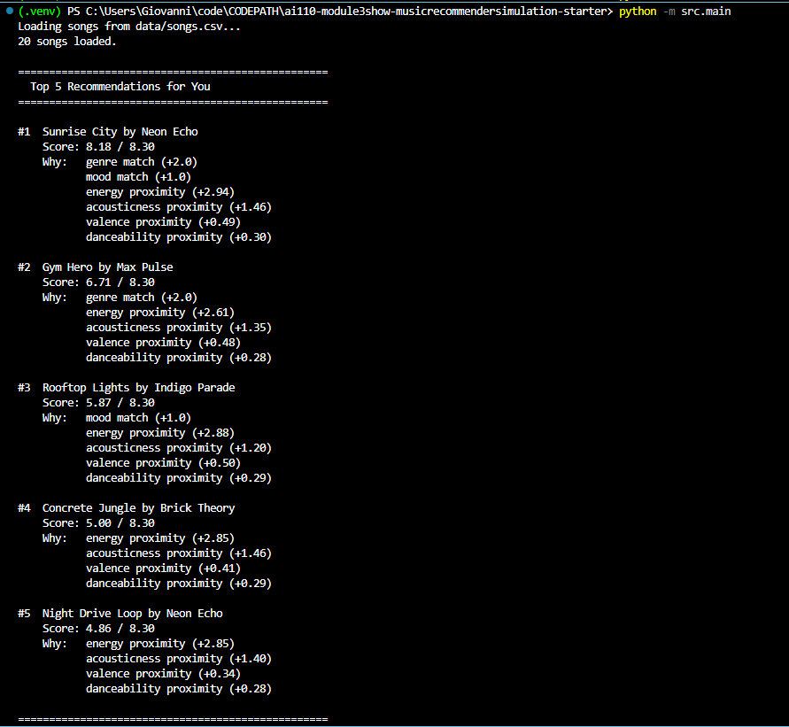
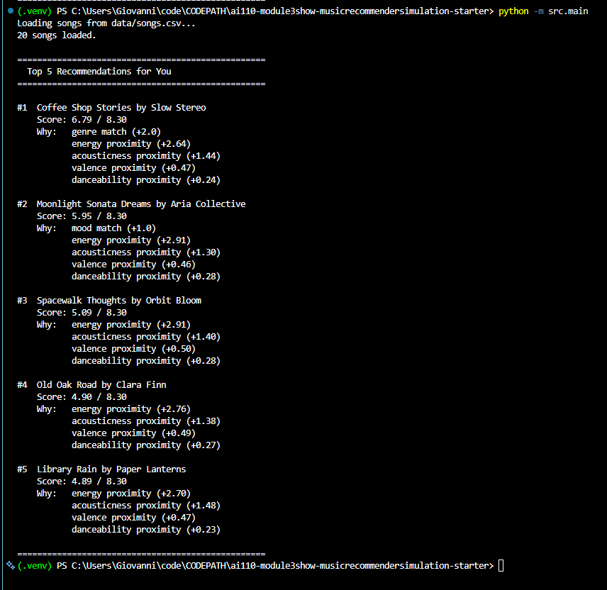

# 🎵 Music Recommender Simulation

## Project Summary

In this project you will build and explain a small music recommender system.

Your goal is to:

- Represent songs and a user "taste profile" as data
- Design a scoring rule that turns that data into recommendations
- Evaluate what your system gets right and wrong
- Reflect on how this mirrors real world AI recommenders

Replace this paragraph with your own summary of what your version does.

---

## How The System Works

**Design Explanation**

Each `Song` stores seven attributes: categorical descriptors `genre` and `mood`, and numeric audio features `energy`, `acousticness`, `valence`, `danceability`, and `tempo_bpm`. The `UserProfile` stores matching preferences: `favorite_genre`, `favorite_mood`, `target_energy`, a `likes_acoustic` boolean, `target_valence`, and `target_danceability`.

**Algorithm Recipe**

Each song is scored by combining flat points for categorical matches with proximity points for numeric features. Proximity is calculated as `max_points × (1 - |song_value - user_target|)`, which awards full points for a perfect match and decreases as values diverge.

```
score = 2.0  × genre_match              (1.0 if match, 0.0 if not)
      + 1.0  × mood_match               (1.0 if match, 0.0 if not)
      + 3.0  × (1 - |song.energy        - target_energy|)
      + 1.5  × (1 - |song.acousticness  - acousticness_target|)
      + 0.5  × (1 - |song.valence       - target_valence|)
      + 0.3  × (1 - |song.danceability  - target_danceability|)
```

Maximum possible score: **8.3 points**. `acousticness_target` is `0.85` if `likes_acoustic` is `True`, `0.15` if `False`. Every song is scored independently, then sorted descending, and the top `k` results are returned.

**Real-World vs. This Version**

Real platforms like Spotify infer preferences from implicit behavior — skips, replays, saves — and combine collaborative filtering, deep audio models, and real-time context signals to recommend songs users didn't know they wanted.

This version prioritizes transparency over sophistication. Preferences are declared explicitly, every score is traceable to specific features and weights, and there is no learning loop. It is an honest content-based recommender — the right foundation for understanding recommendation mechanics before adding behavioral complexity.

**Potential Biases**

- **Genre over-prioritization** — with +2.0 points, a genre match can outweigh several strong numeric matches. A song that perfectly fits the user's energy, mood, and acoustic preference but belongs to a different genre may rank lower than a mediocre match in the right genre.
- **Catalog skew** — the dataset has 3 lofi songs and only 1 each of most other genres. If a user prefers lofi, they have more candidates to match against than a user who prefers blues or reggae.
- **Declared vs. actual preferences** — the system trusts the user profile completely. If a user says they prefer high energy but actually enjoys calm music in the evening, the recommender has no way to detect or adapt to that gap.
- **No diversity enforcement** — the ranking rule returns the top `k` scores with no constraint on variety, so a user could receive 5 songs with nearly identical profiles.

---

## Getting Started

### Setup

1. Create a virtual environment (optional but recommended):

   ```bash
   python -m venv .venv
   source .venv/bin/activate      # Mac or Linux
   .venv\Scripts\activate         # Windows

2. Install dependencies

```bash
pip install -r requirements.txt
```

3. Run the app:

```bash
python -m src.main
```

### Running Tests

Run the starter tests with:

```bash
pytest
```

You can add more tests in `tests/test_recommender.py`.

---

## Evaluation

### Test 1 — Original Pop / Happy Profile

The first test used a pop/happy user profile to verify the scorer was returning sensible results:

- **Genre:** pop
- **Mood:** happy
- **Target Energy:** 0.80
- **Likes Acoustic:** False
- **Target Valence:** 0.82
- **Target Danceability:** 0.80



Sunrise City ranked first with a score of 7.54 / 8.30 — the only song in the catalog that matched both genre (pop) and mood (happy), earning the full +3.0 categorical bonus. The energy (0.82), valence (0.84), and danceability (0.79) were all close to the user targets, producing strong proximity scores across every feature. Gym Hero ranked second despite missing the mood match, because its energy (0.93) and genre (pop) kept its total score competitive.

---

### Test 2 — Jazz / Peaceful Profile

The second test used a profile substantially different from Test 1 to verify that the scorer responds correctly to opposite preferences:

- **Genre:** jazz _(changed from pop)_
- **Mood:** peaceful _(changed from happy)_
- **Target Energy:** 0.25 _(changed from 0.80)_
- **Likes Acoustic:** True _(changed from False — acousticness target flips to 0.85)_
- **Target Valence:** 0.65 _(changed from 0.82)_
- **Target Danceability:** 0.35 _(changed from 0.80)_



**What changed and why it matters:** Every feature was moved toward the opposite end of the scale. Flipping `likes_acoustic` from `False` to `True` shifts the acousticness target from `0.15` to `0.85`, which is the single largest swing in the scoring formula (+1.5 max points). Dropping `target_energy` from `0.80` to `0.25` demotes all high-energy songs that previously ranked well, since energy carries the heaviest numeric weight (+3.0 max points).

**Expected new top results:** Coffee Shop Stories (jazz genre match + acousticness 0.89 + energy 0.37), Moonlight Sonata Dreams (peaceful mood match + acousticness 0.98 + energy 0.22), Old Oak Road (acousticness 0.93 + energy 0.33). Songs that ranked highly in Test 1 — Gym Hero, Storm Runner, Voltage Rush — should drop to the bottom due to high energy and low acousticness.

---

## Limitations and Risks

Summarize some limitations of your recommender.

Examples:

- It only works on a tiny catalog
- It does not understand lyrics or language
- It might over favor one genre or mood

You will go deeper on this in your model card.

---

## Reflection

Read and complete `model_card.md`:

[**Model Card**](model_card.md)

Write 1 to 2 paragraphs here about what you learned:

- about how recommenders turn data into predictions
- about where bias or unfairness could show up in systems like this


---

## 7. `model_card_template.md`

Combines reflection and model card framing from the Module 3 guidance. :contentReference[oaicite:2]{index=2}  

```markdown
# 🎧 Model Card - Music Recommender Simulation

## 1. Model Name

Give your recommender a name, for example:

Music Curator v0.1

---

## 2. Intended Use

This recommender suggests 5 songs from a growing catalog based on a user's preferred genre, mood, energy level, and acoustic preference. It is designed as a functional content-based filtering system intended to scale as the catalog expands. While it currently uses a small dataset for development and testing, it is built with real recommendation logic and is not limited to educational use.

---

## 3. How It Works (Short Explanation)

How Real-World Recommenders Work

Platforms like Spotify and YouTube predict what users will love by combining two approaches. Collaborative filtering analyzes the behavior of millions of users — skips, replays, saves, and playlist adds — to find listeners with similar taste and surface songs those listeners love. Content-based filtering takes a different angle, analyzing the attributes of the music itself — tempo, energy, mood, genre — to find songs that sound and feel similar to ones you already enjoy. Real platforms layer both approaches together, adding contextual signals like time of day and device type, and use reinforcement learning to continuously improve based on what users actually do next.

What This Version Prioritizes

This simulation uses a pure content-based approach. Rather than inferring preferences from behavior, the user declares them explicitly through a profile that stores a favorite genre, a preferred mood, a target energy level, and an acoustic preference. Each song is scored by measuring how close its attributes are to those targets using a weighted proximity formula — features with stronger predictive signal, like energy and genre, carry more weight than features that are more redundant, like danceability and tempo. Every score is fully traceable, making this version transparent and easy to reason about, at the cost of the serendipity and personalization depth that behavioral data provides.

Each Song in the catalog is described by seven attributes. Two are categorical: genre (such as pop, lofi, rock, or jazz) and mood (such as happy, chill, intense, or focused). Five are numeric and measured on a 0 to 1 scale: energy (overall intensity), acousticness (organic vs. electronic sound), valence (musical positivity), and danceability (suitability for dancing). tempo_bpm is also numeric but measured in beats per minute, so it is normalized to a 0 to 1 scale before scoring.

The UserProfile stores four preference fields that map directly to song attributes: favorite_genre, favorite_mood, target_energy (a number between 0 and 1), and likes_acoustic (a true or false flag that is converted to a target acousticness value of 0.85 for acoustic preference or 0.15 for electronic preference). This direct mapping is what makes weighted proximity scoring possible — every user preference has a corresponding song attribute to compare agains

---

## 4. Data

Describe your dataset.

- How many songs are in `data/songs.csv`
- Did you add or remove any songs
- What kinds of genres or moods are represented
- Whose taste does this data mostly reflect

---

## 5. Strengths

Where does your recommender work well

You can think about:
- Situations where the top results "felt right"
- Particular user profiles it served well
- Simplicity or transparency benefits

---

## 6. Limitations and Bias

Where does your recommender struggle

Some prompts:
- Does it ignore some genres or moods
- Does it treat all users as if they have the same taste shape
- Is it biased toward high energy or one genre by default
- How could this be unfair if used in a real product

---

## 7. Evaluation

How did you check your system

Examples:
- You tried multiple user profiles and wrote down whether the results matched your expectations
- You compared your simulation to what a real app like Spotify or YouTube tends to recommend
- You wrote tests for your scoring logic

You do not need a numeric metric, but if you used one, explain what it measures.

---

## 8. Future Work

If you had more time, how would you improve this recommender

Examples:

- Add support for multiple users and "group vibe" recommendations
- Balance diversity of songs instead of always picking the closest match
- Use more features, like tempo ranges or lyric themes

---

## 9. Personal Reflection

A few sentences about what you learned:

- What surprised you about how your system behaved
- How did building this change how you think about real music recommenders
- Where do you think human judgment still matters, even if the model seems "smart"

