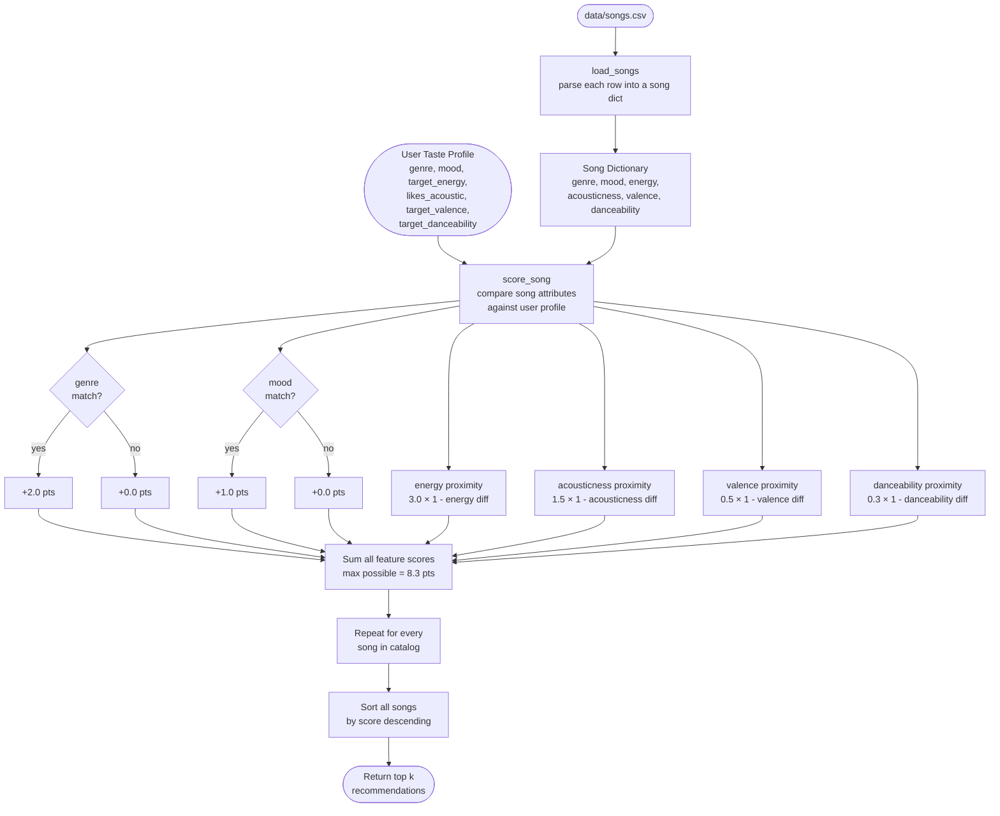

# Recommendation Pipeline Flowchart

This diagram shows how a single song moves from `data/songs.csv` to a ranked recommendation.

```mermaid
flowchart TD
    A([data/songs.csv]) --> B[load_songs\nparse each row into a song dict]
    B --> C[Song Dictionary\ngenre, mood, energy,\nacousticness, valence, danceability]

    U([User Taste Profile\ngenre, mood, target_energy,\nlikes_acoustic, target_valence,\ntarget_danceability]) --> D

    C --> D[score_song\ncompare song attributes\nagainst user profile]

    D --> E{genre\nmatch?}
    E -- yes --> F[+2.0 pts]
    E -- no  --> G[+0.0 pts]

    D --> H{mood\nmatch?}
    H -- yes --> I[+1.0 pts]
    H -- no  --> J[+0.0 pts]

    D --> K[energy proximity\n3.0 × 1 - energy diff]
    D --> L[acousticness proximity\n1.5 × 1 - acousticness diff]
    D --> M[valence proximity\n0.5 × 1 - valence diff]
    D --> N[danceability proximity\n0.3 × 1 - danceability diff]

    F & G & I & J & K & L & M & N --> O[Sum all feature scores\nmax possible = 8.3 pts]

    O --> P[Repeat for every\nsong in catalog]
    P --> Q[Sort all songs\nby score descending]
    Q --> R([Return top k\nrecommendations])
```
